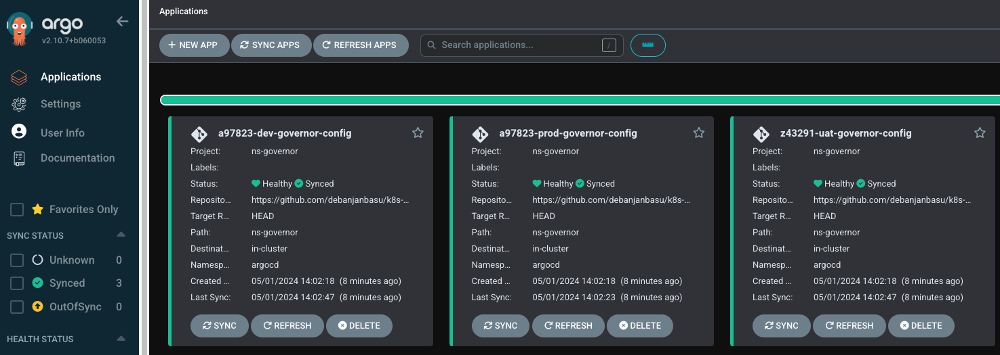

# k8s-namespace-governor

This is a simple project to demonstrate creation of various namespaces using CNCF native tooling. The goal is to provide a simplified experience for multi-tenancy.



## Pre-requisites

- OpenCost (Install with in-built Prometheus or use external)
- ArgoCD

## Roles

For future purpose, a good starting point is to create specific roles which would allow Administrators and Developers to have different levels of access to the namespace. Future roles can be added as required.

[Reference Enterprise Multi-tenancy](https://cloud.google.com/kubernetes-engine/docs/concepts/multitenancy-overview#enterprise_multi-tenancy)

### Initial roles to start with

- Namespace Administrator
- Developer

## Usage

Documenting the steps to get it running on your cluster

### ns-governor

This is the main helm chart that configures each namespace, resources, limits, roles, and much more coming. Please refer to the [README.md](./ns-governor/README.md) inside the folder ns-governor for its documentation. However we're going to consume it via ArgoCD ApplicationSet for our purposes.

### argocd

ArgoCD is configured via the ApplicationSet. Please refer to the [README.md](./argocd/README.md) inside the folder argocd for its documentation.

### projects

The projects folder contains the override values.yaml files for each instance of ns-governor. A sample config might look like:

```yaml
namespace: a97823-ns
destinationServerName: https://kubernetes.default.svc
```